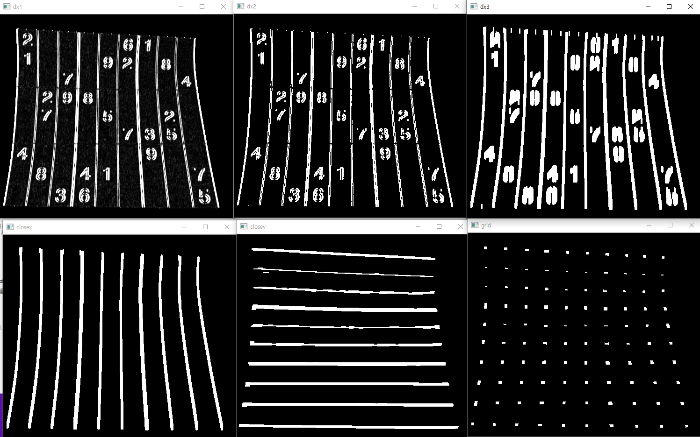
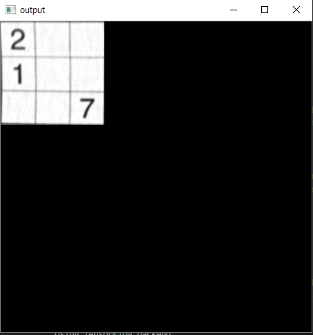

# Sudoku
Children, did you guys get sick of solving Sudoku problems at school?
This project helps you solve it by uploading Sudoku image.


# Dependency
- Python 3
- Opencv
- Keras
- Numpy
- Matplotlib


# Features

Input Image


After MorphologyEx


After Normalization


Adaptive Threshold


Find Contours


Masked


Find grid by using Sobel, MorphologyEx and find Contours




Flatten Image by using warpPerspective()




Crop Cell Numbers


Model
```python
model = Sequential()
model.add(Conv2D(32, kernel_size=(3, 3),activation='relu',input_shape=(shape, shape, channel)))
model.add(Conv2D(64, (3, 3), activation='relu'))
model.add(MaxPooling2D(pool_size=(2, 2)))
model.add(Dropout(0.25))

model.add(Flatten())
model.add(Dense(128, activation='relu'))
model.add(Dropout(0.5))
model.add(Dense(num_classes, activation='softmax'))


#   학습 방법 설정
model.compile(loss='categorical_crossentropy', optimizer='adam', metrics=['accuracy'])

#   학습 시작
model.fit(x_train, y_train, batch_size=128, epochs=12, verbose=1, validation_data=(x_test, y_test))
```

Result


